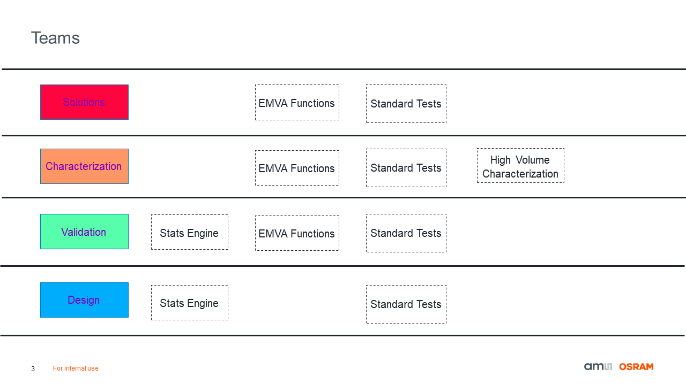

.. characterization_ams documentation master file, created by
   sphinx-quickstart on Fri Feb  4 15:46:49 2022.
   You can adapt this file completely to your liking, but it should at least
   contain the root `toctree` directive.

ams Characterization Module
=====================================================
the **ams Characterization Module** is a module for characterizing CIS sensors in a standardized manner.
This module utilizes the `EMVA1288 4.0 <https://www.emva.org/wp-content/uploads/EMVA1288Linear_4.0Release.pdf>`_ 
definition whenever possible. The core flow is as follows:

|

This module will replace charmware by the end of the year and be integrated with the Image Sensor Toolbox (IST).
A potential user breakdown is shown below:

User Guide
==========

.. toctree::
   :maxdepth: 1
   :caption: Installation

   installation

.. toctree::
   :maxdepth: 6
   :caption: Base Modules

   stats_engine
   emva
   standard_tests

.. toctree::
   :maxdepth: 1
   :caption: Example Usage

   stats_engine_usage
   emva_usage
   standard_tests_usage

.. toctree::
   :maxdepth: 1
   :caption: Methodology

   ptc
   dark_current
   lag
   pls

Indices and tables
==================

* :ref:`genindex`
* :ref:`modindex`
* :ref:`search`

Help
=====
For usage, bugs, or general questions please contact Denver Lloyd (Denver.Lloyd@ams-osram.com).
For installation and EVK related questions please contact Philippe Baetens (Philippe.Baetens@ams-osram.com)

